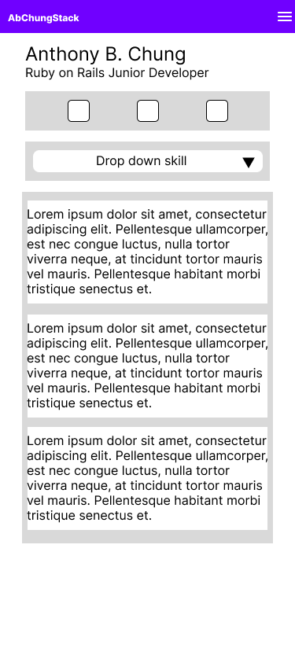
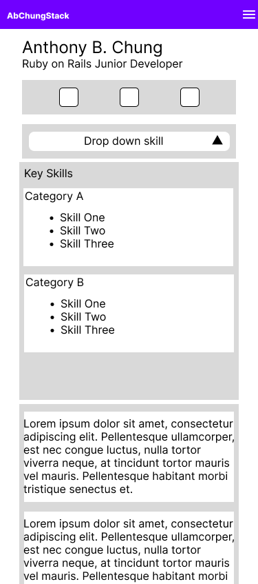
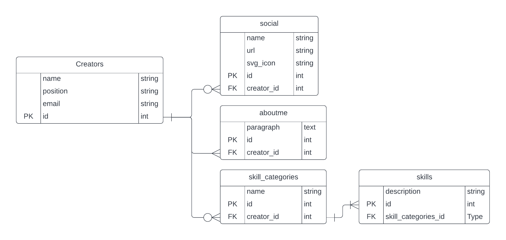

# Project Vision

The web app will assist the creator in creating a web portfolio website. The website will illustrate the following:

- Work Experiences
- Side Projects
- Blog
- Landing Page
- About Me

Each of the above points will have its controller.

## About Me

|  |  |
| ------------------------------------------------------------------- | -------------------------------------------------------------------------- |
| About Me Page with skill closed                                     | About Me Page with drop down skill opened                                  |

### About Me Page

#### Creator

- As a creator, I want to enter my **name**.
- As a creator, I want to enter my **position**.
- As a creator, I want to enter my **email address**.
- As a creator, I want to **list** my **social media pages**.
- As a creator, I want to talk about myself.

- As a creator, I want to **list** my **skills**.

#### Data

An E-R diagram was derived using the above mock-up.

|  |
| ---------------------------------------------------------------------- |
| About-Me Entity-Relationship Diagram                                   |

### Create Models that relate to About-Me Page.

#### Model: Creator

After mini-test. the below validation for Model Creator.

```
class Creator < ApplicationRecord
  before_save {
    self.name = name.downcase.titleize
    self.position = position.downcase.titleize
    self.email = email.downcase
  }

  VALID_EMAIL_REGEX = /\A[\w+\-.]+@[a-z\d\-.]+\.[a-z]+\z/i
  validates :email, format: {with: VALID_EMAIL_REGEX}
end
```

#### Model: Social

| Attribute  | Type   |          |
| ---------- | ------ | -------- |
| name       | string | not null |
| url        | string | not null |
| svg        | string | null     |
| creator_id | bigint | not null |

After mini-test the validation for model Social.

```
belongs_to :creator

  before_validation{
    self.url = url.strip
  }

  validate :first_word

  VALID_URL_REGEX = /\Ahttps:\/\//i

  validates :url,format:{with: VALID_URL_REGEX}

  private

  def first_word
    if svg.split.first != "<svg"
      errors.add(:svg,"must be and svg file")
    end
  end
```

#### Model: AboutMe

| Attribute  | Type |          |
| ---------- | ---- | -------- |
| paragraph  | text | not null |
| creator_id | int  | not null |

After mini-test the validation for model AboutMe

```
class AboutMe < ApplicationRecord
  belongs_to :creator

  validates :paragraph, presence: true
end
```

#### Model: SkillCategory

| Attribute  | Type   |          |
| ---------- | ------ | -------- |
| name       | string | not null |
| creator_id | int    | not_null |

After mini-test the validation for model SkillCategory.

**N.B:** Still needs to work on it during the building of model: Skill

```
class SkillCategory < ApplicationRecord
  belongs_to :creator

  validates :name, presence: true
end
```

#### Model: Skill

| Attribute         | Type   |     |
| ----------------- | ------ | --- |
| description       | string |     |
| skill_category_id | int    |     |

After mini-test the validation for Skill

```
class Skill < ApplicationRecord
  belongs_to :skill_category

  validates :description, presence: true
end
```

#### Model: SkillCategory updated.

```
class SkillCategory < ApplicationRecord
  belongs_to :creator

  has_many :skills, dependent: :destroy <------ added

  validates :name, presence: true
end
```

All models are created now to Controllers and Views.

### Create Views and Controllers for Creator then Readers.

Creator will belong to a user, and a User will has_a creator.

```
rails generate controller creator
```

inside routes

```
resource :creator
```
